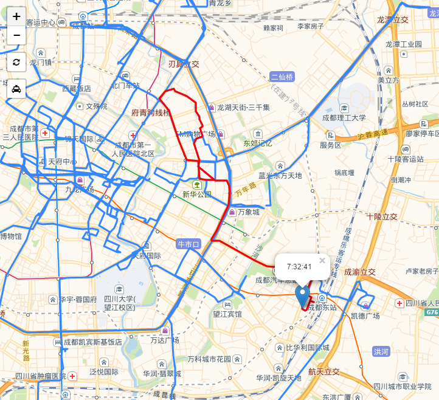

### carpathview + leaflet动态显示车辆轨迹

###### 运行
- windows 双击run.bat运行
- linux使用命令行在当前目录生成目标html文件，打开查看
```
pip install carpathview -i https://pypi.python.org/pypi
python view.py
```

###### 效果




###### 主要代码
```
from carpathview import producePath
producePath(
    latlngs = car_with_most_gps[['lat','lon']].values,
    times = car_with_most_gps['time'],
    deltatime = 200,
)
```

